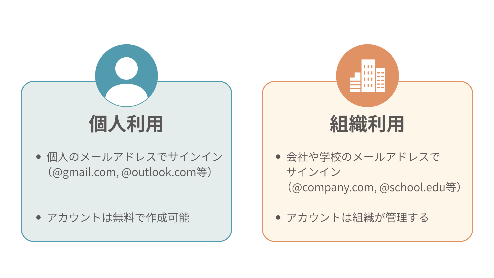
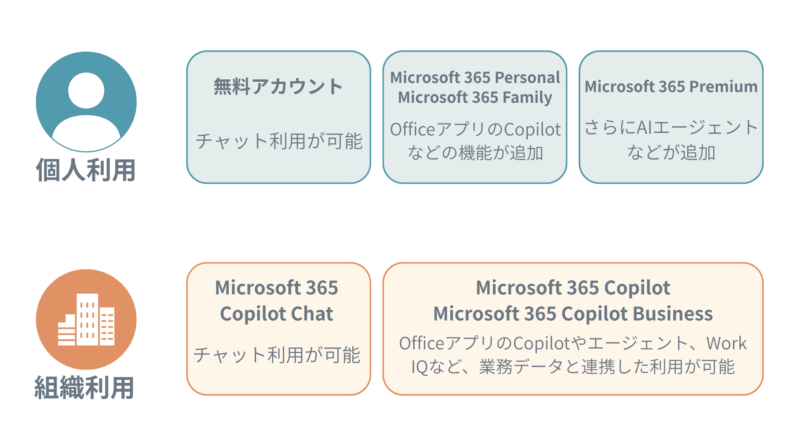
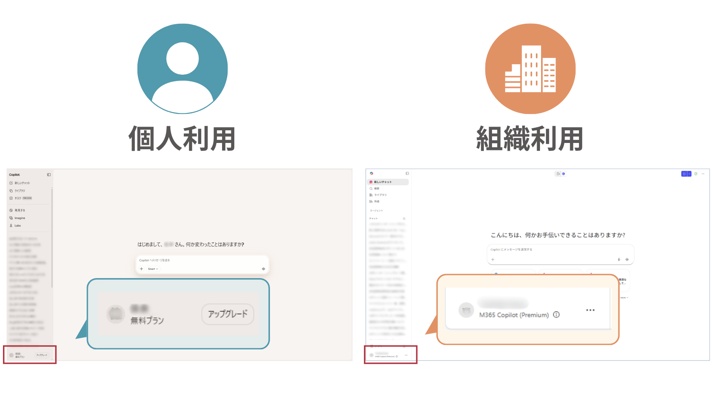

# Copilotのライセンス

Copilotは、契約しているライセンスやアカウントの種類によって、使える機能が大きく異なります。

## アカウントの種類
Microsoftのサービスは、**個人アカウント**と**組織アカウント**で大きく異なります。

### 個人のMicrosoftアカウント
個人のメールアドレスでサインインしたアカウント(@gmail.com, @outlook.com等)が個人のMicrosoftアカウントです。

個人アカウントの場合、ユーザーがCopilotに入力したデータ（文章・画像）は、Microsoft（とその関連会社やパートナー）が**利用する場合があります**。

そのため、入力する内容に個人情報・機密情報が入らないよう、注意して利用する必要があります。

### 組織のアカウント
学校や会社のメールアドレスでサインインしたアカウント（@会社名.com, @学校名.edu等）は、組織のアカウントです。

組織アカウントの場合、Copilotには**エンタープライズ保護**が適用されます。ユーザーが入力したデータは暗号化されるため、Microsoftなど外部の人が閲覧・利用できないようになっています。

> [!IMPORTANT]  
> このリポジトリでは、**組織アカウント**を前提として紹介します。

## Copilotのライセンス
また、Copilotは様々な機能がありますが、アカウントに付与されているライセンスによって利用できる機能が異なります。

### 個人用のライセンス
- **ライセンスなし（無料アカウント）**：個人アカウント向けのCopilot Chatが利用できます。
- **Microsoft 365 Personal/Family**：Word/Excel/PowerPoint等のOfficeアプリと連携したCopilotが利用できるようになります。
- **Microsoft 365 Premium**：Personal/Familyの機能に加え、AIエージェントなどより多くの機能が利用できます。

### 組織用のライセンス
- **Microsoft 365 Copilot Chat**：通常のMicrosoft 365ライセンスのみで利用できるプランで、組織向けのCopilot Chatが利用できます。
- **Microsoft 365 Copilot/Copilot Business**：Word/Excel/PowerPoint等のOfficeアプリやTeams,Outlookのやりとりなど、日々の業務データと連携した機能が利用できます。

## 自分のライセンスの見分け方

1. **個人アカウントと組織アカウントを見分ける**

紐づいているメールアドレスや、普段の利用方法（会社で利用している、個人的に利用している、等）から、個人/組織アカウントを識別します。

2. **Copilot Chatにアクセスする**

**個人アカウント**の場合は[https://copilot.microsoft.com/](https://copilot.microsoft.com/)を、

**組織アカウント**の場合は[https://m365.cloud.microsoft/?auth=2](https://m365.cloud.microsoft/?auth=2)にアクセスし、サインインします。

3. **ライセンスを確認する**

画面左下を確認すると、ライセンスが確認できます。

組織アカウントの場合、以下の2種類の表記になります。
- **M365 Copilot(Basic)**：Microsoft 365ライセンスがあれば利用できる基本の状態（Microsoft 365 Copilot Chat）です。Microsoft Copilot Chatが利用できます。

- **M365 Copilot(Premium)**：Microsoft 365 Copilotの追加ライセンス（Microsoft 365 Copilot/Copilot Business）を割り当てられている状態です。組織のデータと連携できる、さまざまな機能が利用できます。

---
[概要](./README.md) ⬅️ | [🏠](./README.md) | ➡️ [Coplot Chat-基礎](./01-CopilotChat.md)