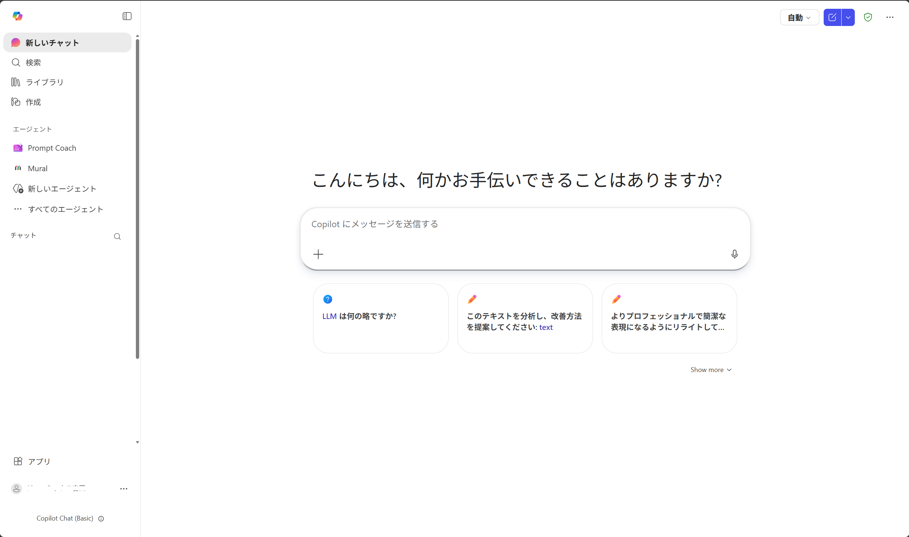
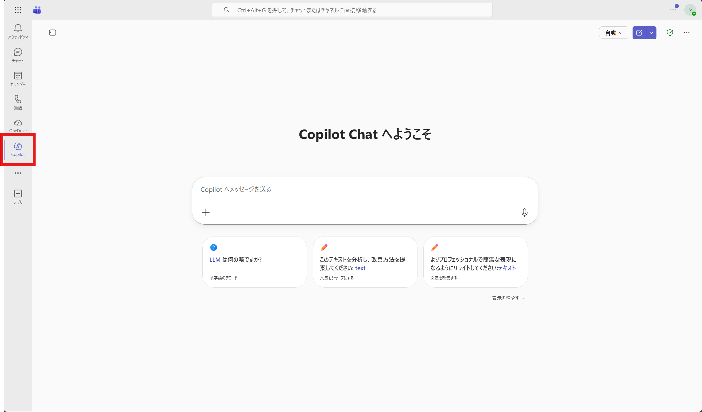
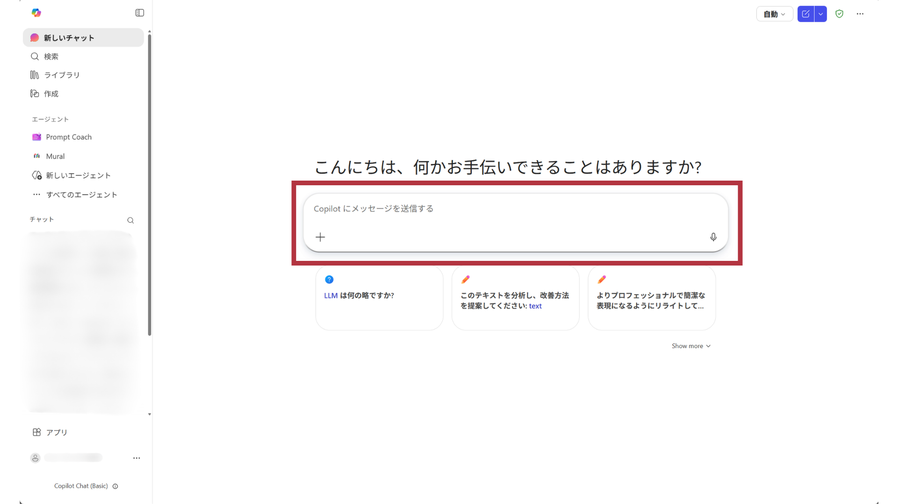
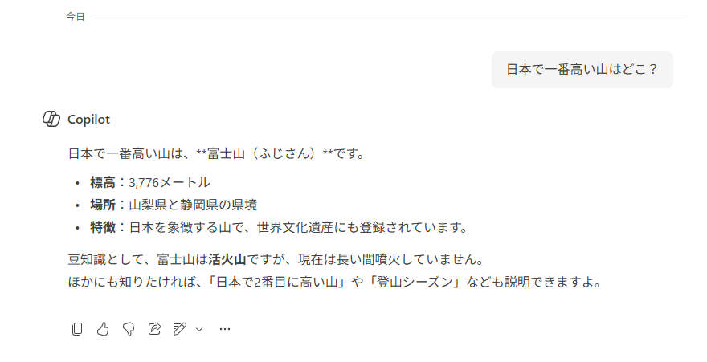
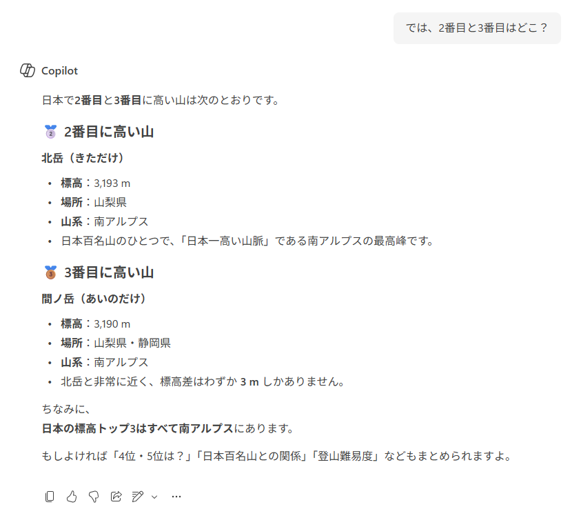
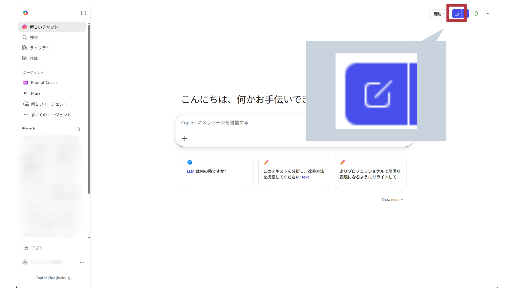

# Copilot Chat
Microsoft 365 Copilot Chatを使って、AIとチャットをしましょう。

> [!IMPORTANT]  
> ここからは、組織アカウント（M365 Copilot Basic）を前提として操作を説明します。

## Microsoft Copilot Chatにアクセスする
複数の方法でアクセスできます。

### ブラウザからアクセスする
[https://m365.cloud.microsoft/?auth=2](https://m365.cloud.microsoft/?auth=2)にアクセスします。

必要があれば、サインインします。

この画面になったら、アクセス完了です。



### Teamsからアクセスする
Teamsアプリを立ち上げ、左のサイドバーにあるCopilotをクリックするとアクセスできます。



### アプリからアクセスする
Storeアプリからインストールできます。

[Microsoft 365 Copilot | Microsoft Store](https://apps.microsoft.com/detail/9wzdncrd29v9?hl=ja-jp&gl=JP)

> [!CAUTION]  
> [Copilot](https://apps.microsoft.com/detail/9nht9rb2f4hd?hl=ja-JP&gl=JP)というアプリもありますが、こちらは**個人アカウント用**です。組織アカウントを利用したい場合は**Microsoft 365 Copilot**を利用してください。

## チャットをする
チャットは、画面にあるチャット入力欄に質問を入力し、送信します。



まずは次のような質問を入力し、送信します。
```
日本で一番高い山はどこ？
```
すぐに回答が出力されます。



続いて、次のように入力し、送信します。
```
では、2番目と3番目はどこ？
```



回答が出力されます。明示的に「高い山」と書かなくても、今までの会話の文脈を読み取って回答することができます。

## 会話をリセットする
会話をリセットするには、「新しいチャットを開始する」ボタンをクリックします。



リセットしても、今までの会話は履歴に保存され、いつでも呼び出すことができます。

---
[Copilotのライセンス](./00-License.md) ⬅️ | [🏠](./README.md) | ➡️ [Coplot Chat-応用](./02-CopilotChat-ad.md)