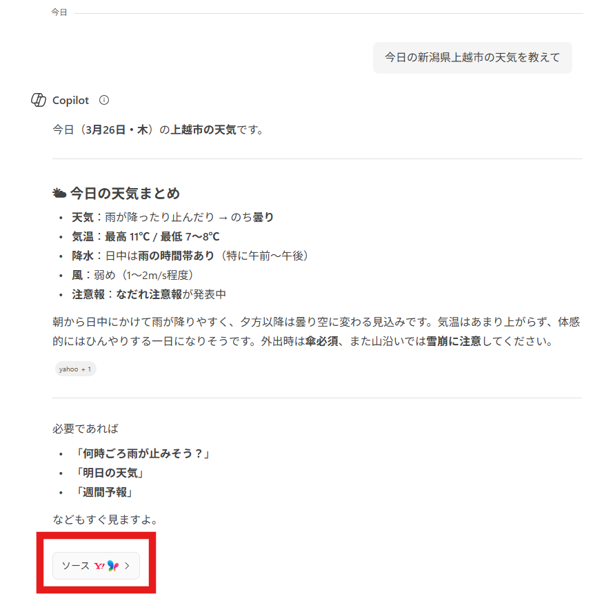
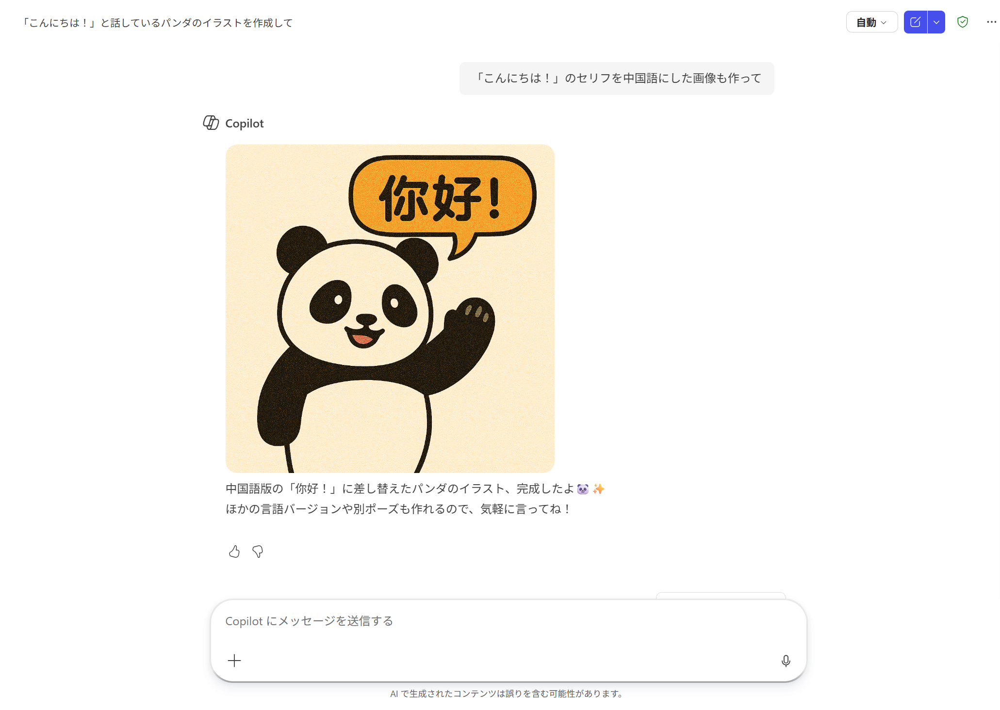
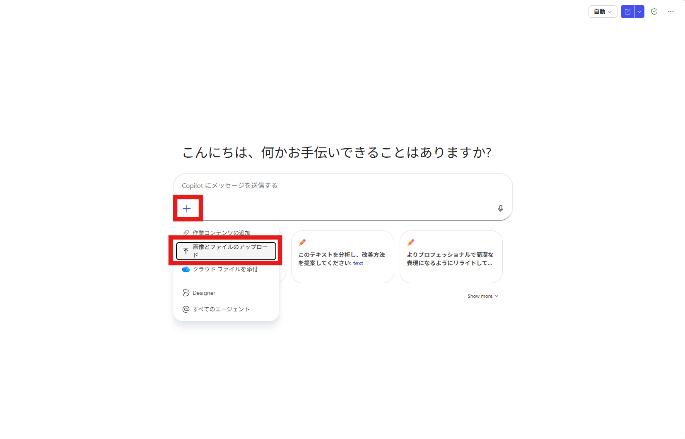
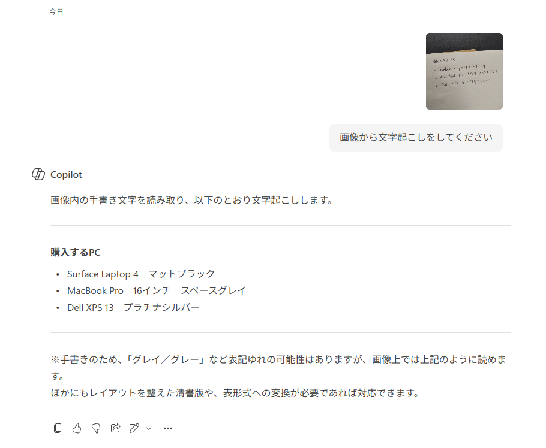
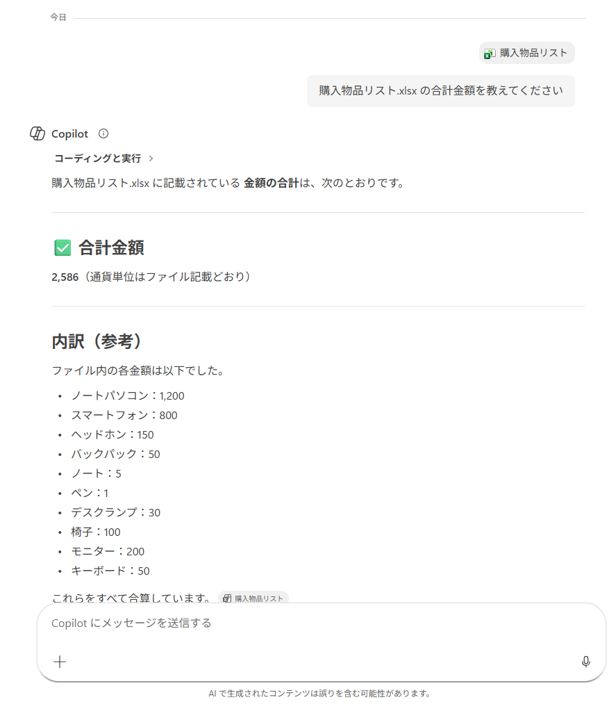

# Copilot Chat（応用）
ここでは、さらに便利な機能を紹介します。


## 検索して回答させる
Microsoft Copilot ChatはBing検索エンジンと連携しており、リアルタイムの情報やウェブサイトの記事を引用して回答することもできます。

会話をリセットしてから、次の質問を入力し、送信します。
```
今日の新潟県上越市の天気を教えて
```



天気予報のサイトを自動で検索し、情報を引用して回答します。

また、引用したサイトも提示されます。

ソースからサイトを選択すると、別タブで表示できます。


> [!IMPORTANT]  
> 生成AIは、検索機能の有無に関わらず、誤った回答をすることがあります。（**ハルシネーション**と呼ばれる現象です）  
> 信憑性が重要な話題は、引用されたウェブサイトにアクセスして、情報を精査するようにしましょう。

## 画像を生成させる
画像を生成させることもできます。

会話をリセットしてから、次の質問を入力し、送信します。
```
「こんにちは！」と話しているパンダのイラストを作成して
```


少し時間がかかりますが、画像が生成されます。

続いて、次のように入力し、送信します。
```
「こんにちは！」のセリフを中国語にした画像も作って
```


文字の描画や画像修正も、精度高く生成できます。

## 画像・ファイルを添付する
画像やファイルをアップロードして、質問をすることができます。

> [!IMPORTANT]  
> 個人アカウントで利用するときは、入力した文章・画像・ファイルはMicrosoftがAI学習に使う場合があります。  
> 個人情報・機密情報を流出しないよう、十分に注意して利用してください。  
> 組織アカウントの場合はエンタープライズ保護が適用されるため、学習には利用されません。

### OCR（光学文字認識）
1. [こちらに保存されている画像](./TestData/購入PCリスト.jpg)を、一度PCにダウンロードします

2. Copilot Chatにアクセスします

3. 「+」ボタンから、「画像とファイルのアップロード」を選択し、1.をアップロードします  ※**まだ送信しません**



> [!TIPS]  
> OneDriveやSharePointに保存されているファイルは、「クラウドファイルを添付」を選択することで、ダウンロードせずに直接Copilotに添付できます。

3. 続けて次のように入力し、送信します
    ```
    画像から文字起こしをしてください
    ```

4. 文字起こしされます。このように、画像から文字を読み取る技術を**OCR（光学文字認識）**といいます




### Excelデータの認識
1. [購入物品リスト.xlsx](./TestData/購入物品リスト.xlsx)をダウンロードします
2. Copilot Chatにアクセスします

3. 「+」ボタンから、「画像とファイルのアップロード」を選択し、1.をアップロードします

3. 次のように入力し、送信します
    ```
     購入物品リスト.xlsx の合計金額を教えてください
    ```
4. ファイルのデータを読み取ったうえで、計算処理を行うこともできます



---
[Coplot Chat](./01-CopilotChat.md) ⬅️ | [🏠](./README.md) | ➡️ [プロンプト](./03-Prompt.md)