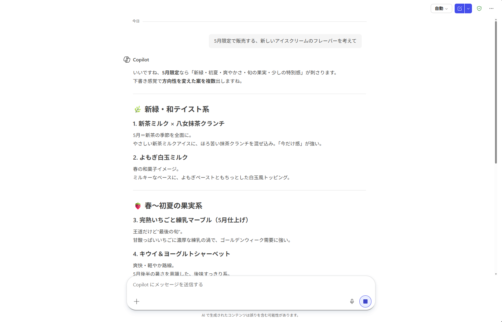
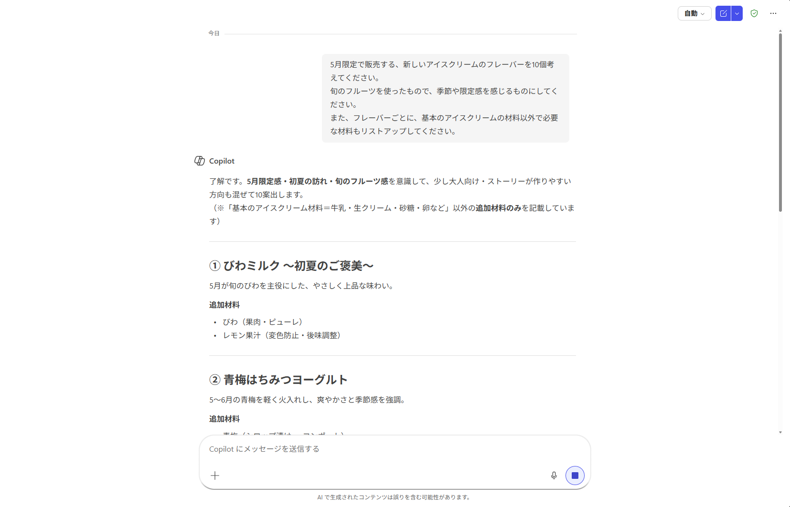
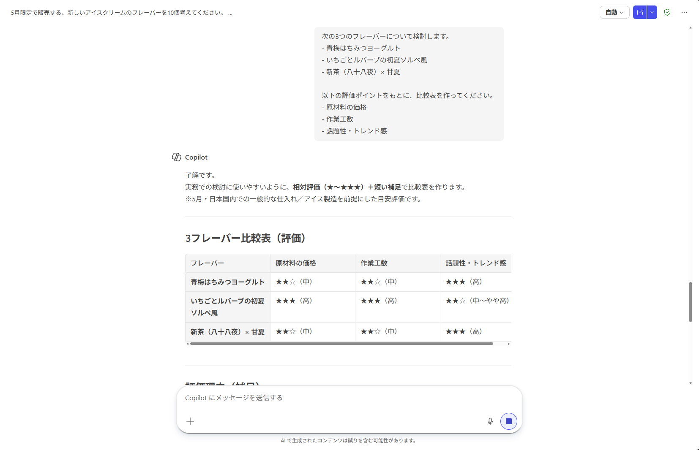
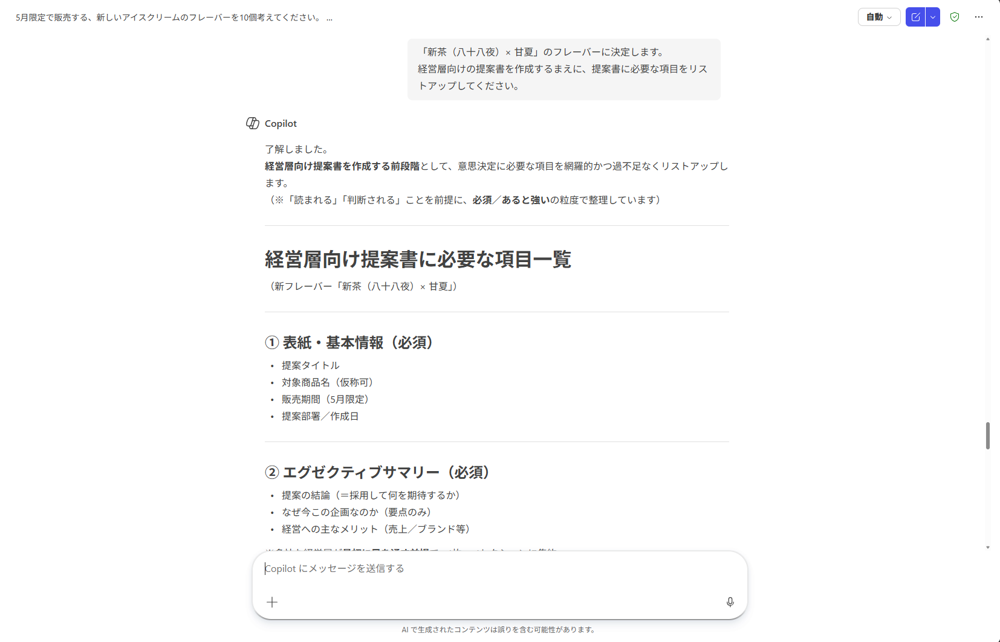
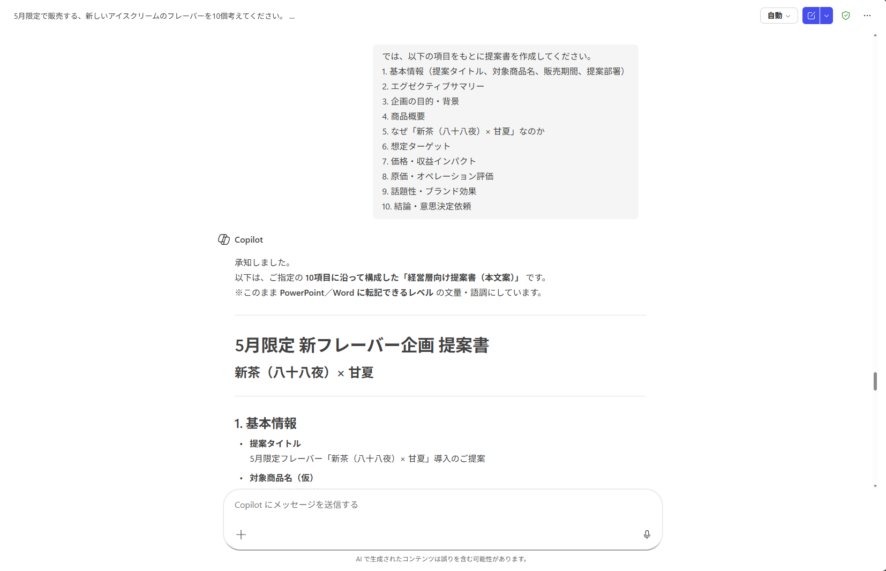

# プロンプト

## プロンプトとは
**プロンプト**とは、生成AIに送信する文章（質問・相談・指示など）のことです。

従来のコンピューターは、プログラミングやコマンド入力、事前に決められた操作によって動かしてきました。

それに対して生成AIは、自然言語（人間が普段使う言葉）で指示できるのが大きな特徴です。
プロンプトを工夫することで、生成される出力を調整できます（**プロンプトエンジニアリング**といいます）。

## プロンプトの事例
プロンプトを上手に書くには、日ごろから様々な場面で生成AIを使い、慣れることが大切です。

**アイスクリームショップの商品開発**を題材として、状況に応じたプロンプトを試してみましょう。


## プロンプト例①：アイデア出し
5月限定のフレーバーを開発します。旬のフルーツを使った、季節感・限定感のあるものにしたいと考えています。

どのようなフレーバーにするか考えるため、Copilotにアイデアを出してもらいましょう。

まずは、新しいチャットで次のように入力・送信します。
```
5月限定で販売する、新しいアイスクリームのフレーバーを考えて
```
**結果**



10～15個程度のアイデアが出てきます。

これだけでもヒントになりますが、「**旬のフルーツを使ったもの以外が出てくる**」「**出力数が安定しない**」など、自分の想定にない挙動をすることがあります。

では、**新しいチャットに切り替えて**、次のプロンプトを入力・送信します。

```
5月限定で販売する、新しいアイスクリームのフレーバーを10個考えてください。
旬のフルーツを使ったもので、季節や限定感を感じるものにしてください。
また、フレーバーごとに、基本のアイスクリームの材料以外で必要な材料もリストアップしてください。
```

**結果**



（出力概要）
> ① びわミルク ～初夏のご褒美～  
> ② 青梅はちみつヨーグルト  
> ③ 甘夏とバニラのマーブル  
> ④ いちごとルバーブの初夏ソルベ風  
> ⑤ 国産キウイとミント  
> ⑥ メロンミルク ～走りの香り～  
> ⑦ びわ＆アールグレイ  
> ⑧ 初夏パインとココナッツ  
> ⑨ さくらんぼミルク ～はしり季節限定～  
> ⑩ 新茶（八十八夜）× 甘夏  

条件をくみ取りつつ、意思決定に必要な要素も出力できました。

このように、
- 前提条件：xxについて考えます、xxについて相談したいです
- 出力形式：x個考えてください、リストアップしてください
- 思考の条件：旬のフルーツを使ってください

のように指示を具体的にすることで、自分の想定通りに出力することができます。

## プロンプト例②：比較

先ほどCopilotが出したアイデアのうち、次の3つが好感触でした。

- 青梅はちみつヨーグルト
- いちごとルバーブの初夏ソルベ風
- 新茶（八十八夜）× 甘夏

そこで、商品化をするにあたって考慮したい要素①原材料の価格、②作業工数、③話題性・トレンド感、の3点で比較をしたいと思います。

チャットに次のプロンプトを入力・送信します。
```
次の3つのフレーバーについて検討します。
- 青梅はちみつヨーグルト
- いちごとルバーブの初夏ソルベ風
- 新茶（八十八夜）× 甘夏

以下の評価ポイントをもとに、比較表を作ってください。
- 原材料の価格
- 作業工数
- 話題性・トレンド感
```

> [!NOTE]  
> プロンプト例①で出力された結果をもとに進めてもOKです。
> その際、文章は適宜調整してください。

**結果**



指定した要素をもとに比較表を作成できました。

ポイントは、**評価軸を指定すること**です。基準を指定せずに```商品化できそうなフレーバーはどれ？```とだけ聞くと、Copilotが自動的に基準を設定してしまうため、方向性がずれてしまいます。

> [!TIPS]  
> 今回は```比較表を作って```と指定したため、表形式での出力になりました。  
> ```ランキング形式にして```、```それぞれの評価ポイントごとに点数をつけて```といった出力形式もおすすめです。

## プロンプト例③：文書作成

比較表から、「新茶の香りと柑橘のグリーンティー・フルーツミックス」のフレーバーに決定しました。

この内容を経営層に提案するため、企画書を作成します。

チャットに次のプロンプトを入力・送信します。
```
「新茶（八十八夜）× 甘夏」のフレーバーに決定します。
経営層向けの提案書を作成するまえに、提案書に必要な項目をリストアップしてください。
```
**結果**



このように、「**そもそも具体的に何を指示したらいいかわからない**」というときは、作成物を依頼する前に、必要項目を相談するのも手です。

初めから文書を作成すると、過不足の項目による手戻りが増えてしまいます。


提案書に必要な項目を絞って、作成を依頼します。
```
では、以下の項目をもとに提案書を作成してください。
1. 基本情報（提案タイトル、対象商品名、販売期間、提案部署）
2. エグゼクティブサマリー
3. 企画の目的・背景
4. 商品概要
5. なぜ「新茶（八十八夜）× 甘夏」なのか
6. 想定ターゲット
7. 価格・収益インパクト
8. 原価・オペレーション評価
9. 話題性・ブランド効果
10. 結論・意思決定依頼
```
**結果**



> [!CAUTION]  
> 他の人に展開するような内容や、正確さが求められる文書は、必ず一度確認してから展開するようにしてください。


ポイントは、「経営層向けの」というように、**読み手を指定すること**です。

例えば、「経営層向けの」「提案書」の箇所を```「当店のリピーターである女性」``` ```「プレスリリース」```に変更すると、宣伝文に近い文章として出力されます。

## プロンプトのポイント
このように、漠然と依頼するのではなく、
- 前提条件・背景知識
- 誰に向けた文章を生成したいのか
- 出力の形式
- 考え方の指定

といった、具体性をもって依頼することで、自分のイメージに近い出力をすることができます。

---
[Coplot Chat-応用](./02-CopilotChat-ad.md) ⬅️ | [🏠](./README.md) | ➡️ [演習-チャット利用のトレーニング](./04-Chat-exercise.md)