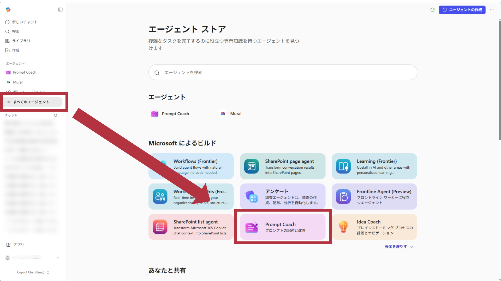
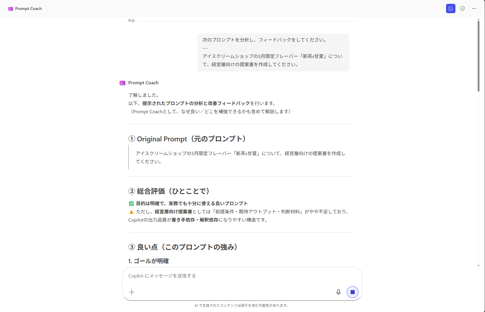
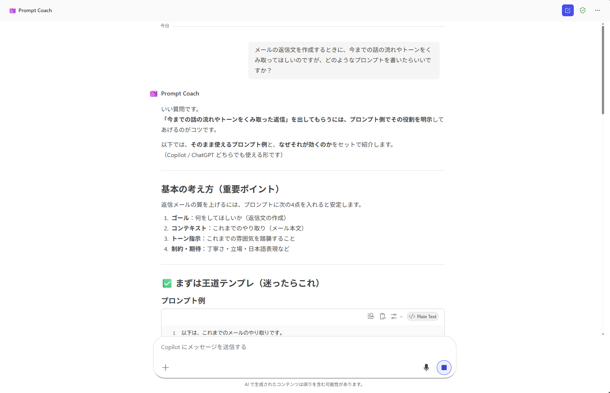
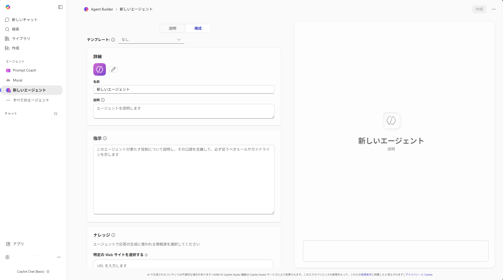

# エージェント
## AIエージェントとは
AIエージェントは、**自律的に思考・実行するAI**です。

CopilotをはじめとしたAIチャットボットは、「ユーザーからの質問に回答する」という仕組みでした。

この技術をさらに発展させたものがAIエージェントです。

ユーザーからの具体的な質問・依頼がなくても、大まかな目標を指定するだけで、自分でタスクを分解して実行することができます。

> [!NOTE]  
> 明確化のため「AIエージェント」と表記しましたが、単に「エージェント」と呼称することが多いです。

## Copilot エージェント
Copilotでもエージェントが利用できます。

Microsoftから提供されているエージェントのほか、サードパーティー（ほかの企業）が提供しているエージェントも利用できます。

また、Copilotのライセンスによっても利用できるエージェントが変わります。

### アクセス方法
Copilot Chatを開きます。

左のサイドバーにある「すべてのエージェント」をクリックします。

実行したいエージェントをクリックすると、チャット画面が開きます。

### Prompt Coachを試す

例として、Prompt Coachを使ってみましょう。

エージェントのうち、「Prompt Coach」をクリックします。



Prompt Coachはプロンプトの専門家エージェントです。より良いプロンプトを書くための相談に乗ったり、プロンプトを分析してアドバイスをすることができます。

まず、過去のプロンプトを分析してもらいましょう。

次の内容を入力・送信します。
```
次のプロンプトを分析し、フィードバックをしてください。
---
アイスクリームショップの5月限定フレーバー「新茶x甘夏」について、経営層向けの提案書を作成してください。
```

**結果**


良いところ・悪いところを整理してアドバイスし、さらに改善案も提示されます。

続いて、より概念的な相談も試してみましょう。

次の内容を入力・送信します。
```
次のプロンプトを分析し、フィードバックをしてください。
---
メールの返信文を作成するときに、今までの話の流れやトーンをくみ取ってほしいのですが、どのようなプロンプトを書いたらいいですか？
```

**結果**


汎用的な技術のアドバイスも対応しています。

## Agent Builder

**Agent Builder**を使って、エージェントは自作することもできます。



参照してほしいソース（ドキュメントやサイトなど）を登録しておくことで、自社ドキュメントなどの限定的な情報を検索して回答することができます。

詳しい作成方法はここでは省略しますが、気になる方は調べてみてください。

> [!CAUTION]
> 自作したエージェントは、共有しない限り他人には公開されませんが、**管理者はすべてのエージェントを確認できます。**  
> 作成する際はアクセス範囲に気を付けて管理をしてください。

---
[演習-チャット利用のトレーニング](./04-Chat-exercise.md) ⬅️ | [🏠](./README.md)